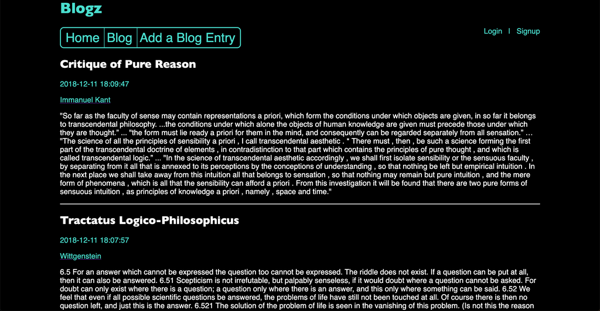

# blogz
LaunchCode LC101 Python Flask Assignment - Deployed on DigitalOcean VM at https://launchcode-blogz.ddns.net/
- Uses MySQL and SQLAlchemy ORM
- Security-conscious hashing+salting of the database
- Form validation with dynamic error messages
- User signup and authentication
- Uses the MVC pattern and deployed on an Ubuntu server

## Infrastructure & Running

systemctl start mysql
systemctl start nginx
systemctl start blogz.service (gunicorn)
[Unit]
Description=Gunicorn instance to serve blogz
After=network.target

[Service]
User=evan
Group=www-data
WorkingDirectory=/home/evan/blogz
Environment="PATH=/home/evan/blogz/blogz-env/bin"
ExecStart=/home/evan/blogz/blogz-env/bin/gunicorn --workers 3 --bind unix:blogz.sock -m 007 wsgi:app

[Install]
WantedBy=multi-user.target 
